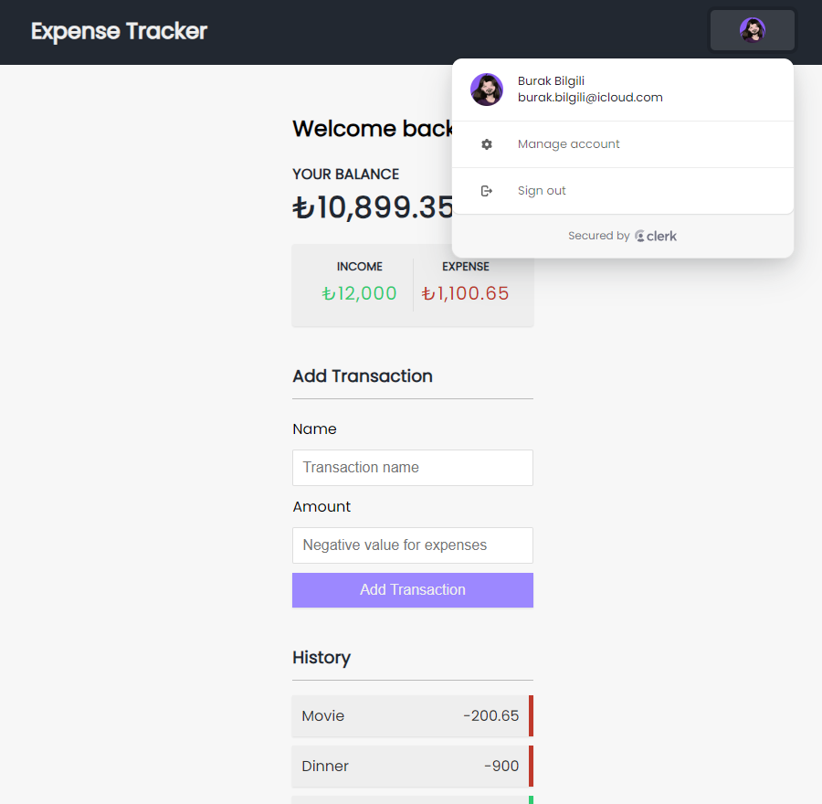

# Expense Tracker

- Track your expenses and create a budget.

## Features

- Next.js
- Typescript
- Server actions
- Neon database
- Prisma
- Clerk Auth

## Getting Started

1. Setup your .env file

```bash
DATABASE_URL: Your db string from Neon.
NEXT_PUBLIC_CLERK_PUBLISHABLE_KEY: Your public frontend API key from Clerk.
CLERK_SECRET_KEY: Your secret key from Clerk.
```

2. Install all dependencies.

```bash
npm install
```

3. Run the development server:

```bash
npm run dev
# or
yarn dev
# or
pnpm dev
# or
bun dev
```

4. Open [http://localhost:3000](http://localhost:3000) with your browser to see the result.

## Screen



---

## License

This project is licensed under the [MIT License](./LICENSE).
